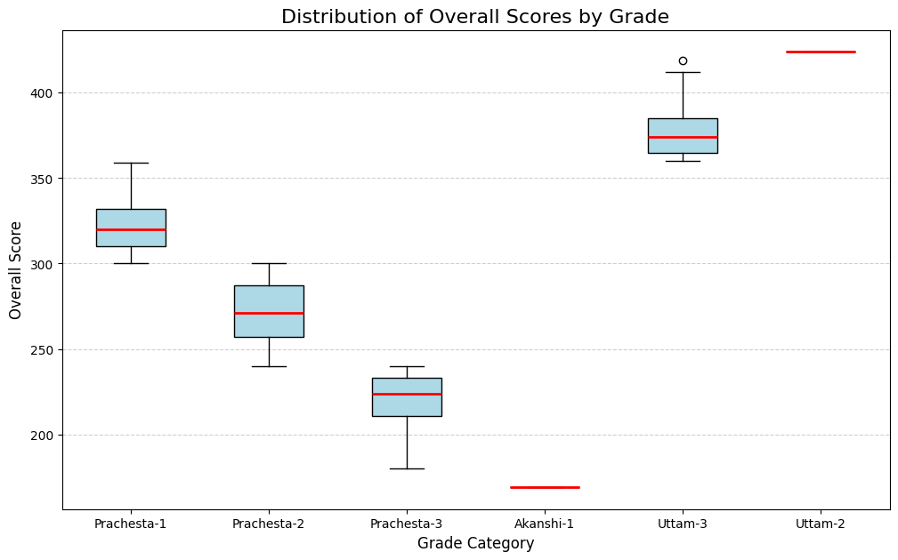
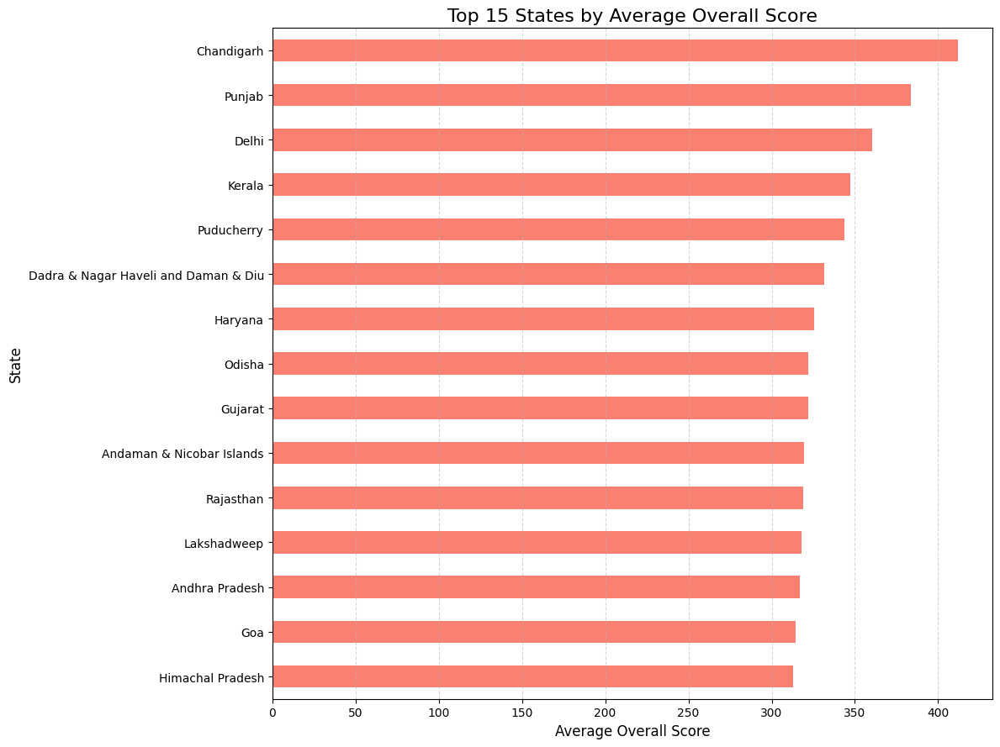
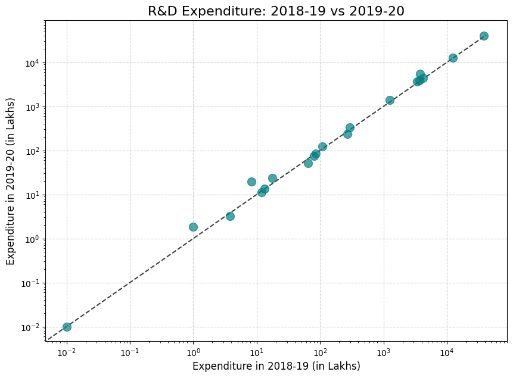
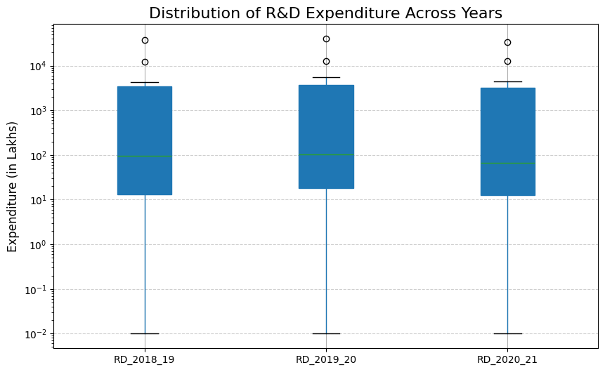
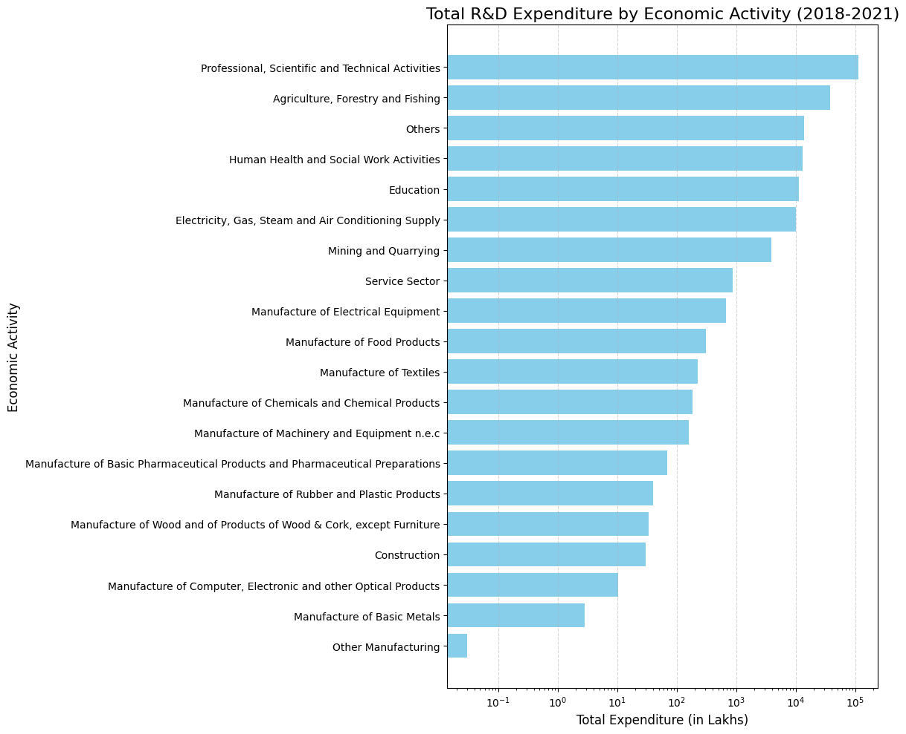

# DS200 Assignment: Data Science Visualization Project  

This repository contains two data analysis and visualization projects created as part of the **DS200: Data Science Visualization** assignment.  
Both projects use datasets from [data.gov.in](https://data.gov.in) and demonstrate **data cleaning, exploratory data analysis (EDA), and visualization** using Python (`pandas`, `matplotlib`, and `seaborn`).

---

## 🔬 Project 1: Analysis of R&D Expenditure by Economic Activity  

[](https://colab.research.google.com/drive/your_colab_link_here)

### Overview  
This project analyzes **Research & Development (R&D) expenditure** across various economic sectors in India for the fiscal years **2018–19, 2019–20, and 2020–21**.  
It identifies key trends, top-spending sectors, and the inequality in national R&D investment.

**Data Source:** [R&D Expenditure by Economic Activity – data.gov.in](https://data.gov.in/)

---

### 📂 Project Structure  
rd-expenditure-analysis/
├── rd_analysis_colab.py
├── rd_bar_chart.png
├── rd_box_plot.png
├── rd_scatter_plot.png
└── readme.md

---

### 📊 Visualizations  

#### Scatter Plot: R&D Expenditure (2018–19 vs. 2019–20)  


#### Box Plot: Distribution of R&D Expenditure (2018–2021)  


#### Bar Chart: Top 10 Sectors by R&D Expenditure (2020–21)  


---

### 🧠 Observations and Inferences  

#### 1. R&D Expenditure (2018–19 vs. 2019–20)
**Observation:** Most sectors lie close to the *y = x* line with a slight upward drift; one dominant outlier stands out.  
**Inference:** Overall spending increased between years, with the *Professional, Scientific and Technical Activities* sector dominating.

#### 2. Distribution of R&D Expenditure (2018–2021)
**Observation:** Data is highly right-skewed, showing a few sectors with very high spending.  
**Inference:** R&D investment is heavily concentrated in select industries, revealing inequality in innovation funding.

#### 3. Top 10 Sectors by Expenditure (2020–21)
**Observation:** The *Professional, Scientific and Technical Activities* sector far outspends all others, followed by *Agriculture* and *Health*.  
**Inference:** National priorities favor scientific and technical R&D, with notable emphasis on agriculture and healthcare.

---

## 🎓 Project 2: Analysis of Indian School Education Performance Data  

[](https://colab.research.google.com/drive/your_colab_link_here)

### Overview  
This project performs an **Exploratory Data Analysis (EDA)** of the **Performance Grading Index for Districts (PGI-D 2023–24)** dataset.  
It visualizes educational performance across districts, grades, and states to uncover relationships among key evaluation categories.

**Data Source:** [Performance Grading Index for Districts (PGI-D 2023–24) – data.gov.in](https://data.gov.in/)

---

### 📂 Project Structure  
education-performance-analysis/
├── education_analysis_colab.py
├── scatter_plot.png
├── box_plot.png
├── bar_chart.png
└── readme.md


---

### 📊 Visualizations  

#### Scatter Plot: Overall Score vs. Outcome Score  


#### Box Plot: Overall Score Distribution by Grade  


#### Bar Chart: Top 15 States by Average Overall Score  


---

### 🧠 Observations and Inferences  

#### 1. Overall vs. Outcome Score  
**Observation:** Strong positive linear correlation between *Outcome* and *Overall* scores.  
**Inference:** Districts with better learning outcomes tend to achieve higher overall scores — confirming internal data consistency.

#### 2. Distribution of Scores by Grade  
**Observation:** Higher grades (*Uttam*) have higher medians and broader ranges; lower grades (*Prachesta*) cluster at lower scores.  
**Inference:** Grade classifications effectively represent district-level education performance bands.

#### 3. Top States by Average Overall Score  
**Observation:** *Punjab*, *Chandigarh*, and *Rajasthan* lead with the highest average district scores.  
**Inference:** These states exhibit strong educational governance and outcomes, though intra-state variation persists.

---

## 🚀 Getting Started  

### Prerequisites  
Install the required Python libraries:
```bash
pip install pandas matplotlib seaborn
Running the Analysis

Clone the repository and open the Colab notebooks:

git clone https://github.com/<your-username>/ds200-visualization-project.git
cd ds200-visualization-project
